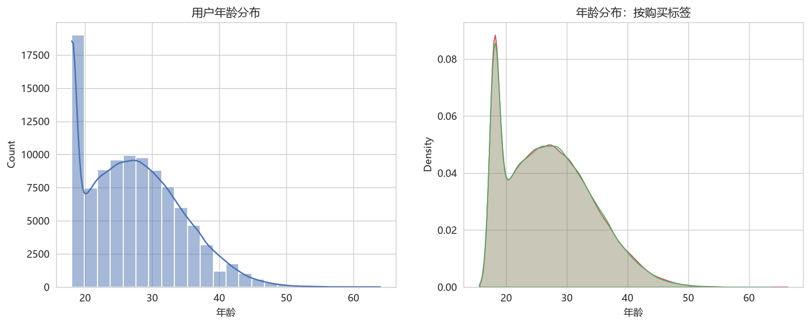
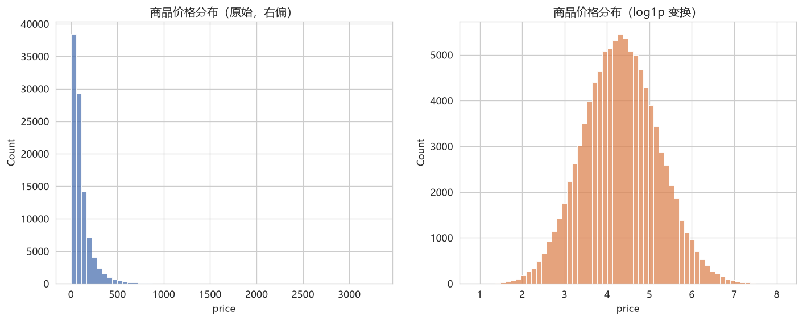
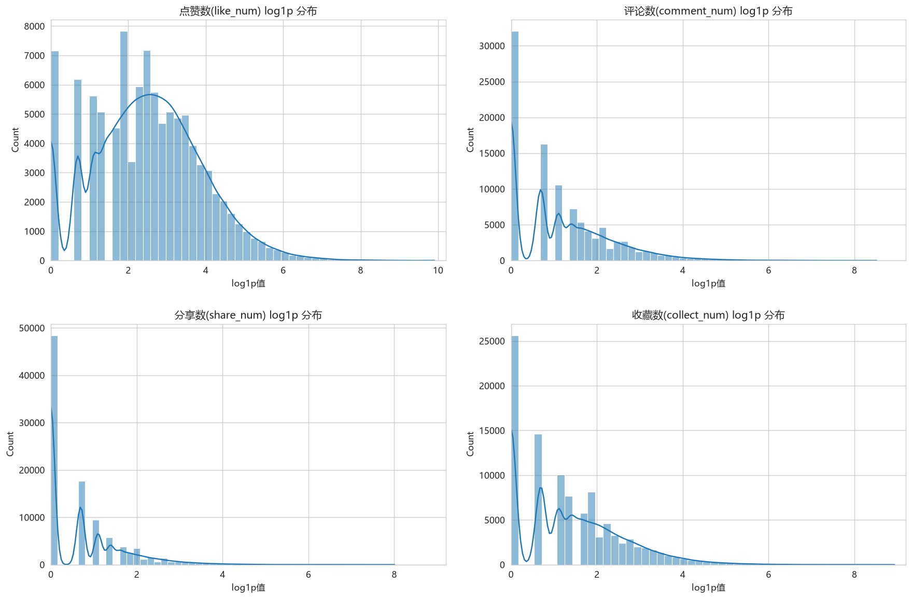
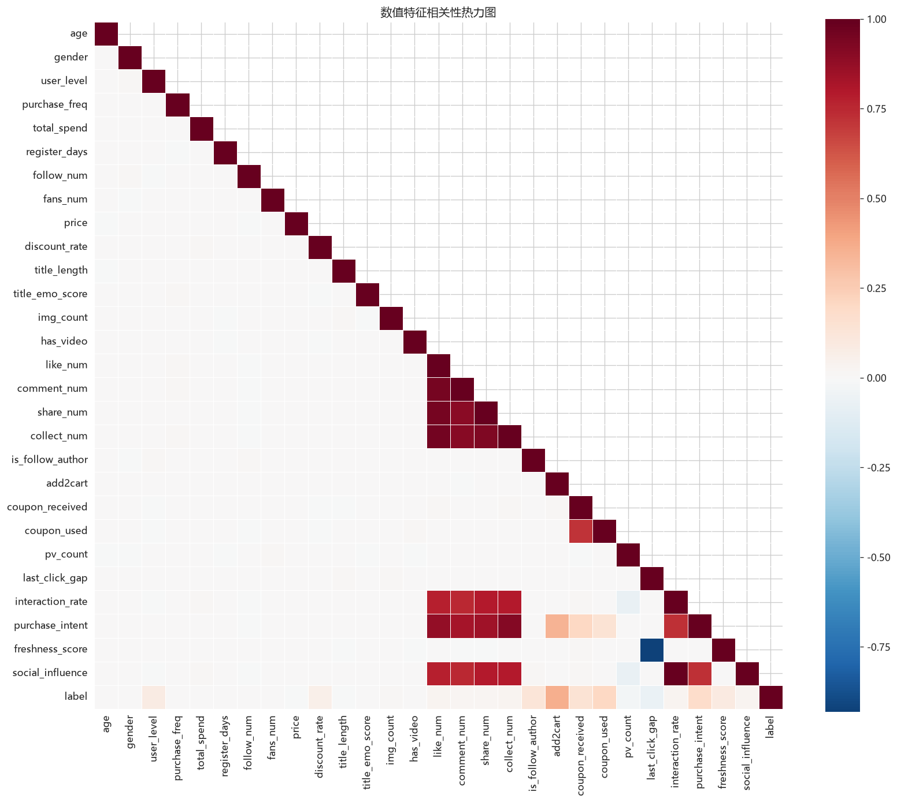
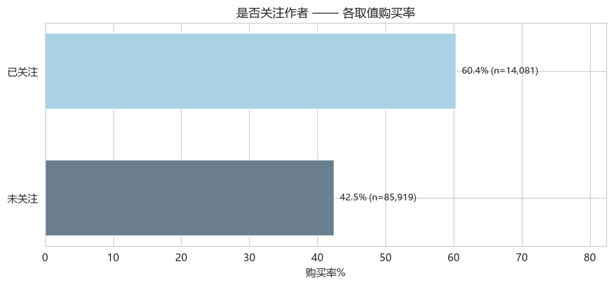
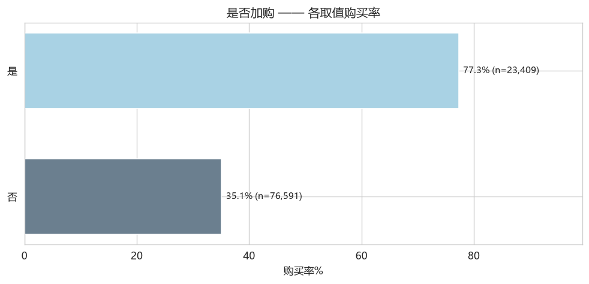
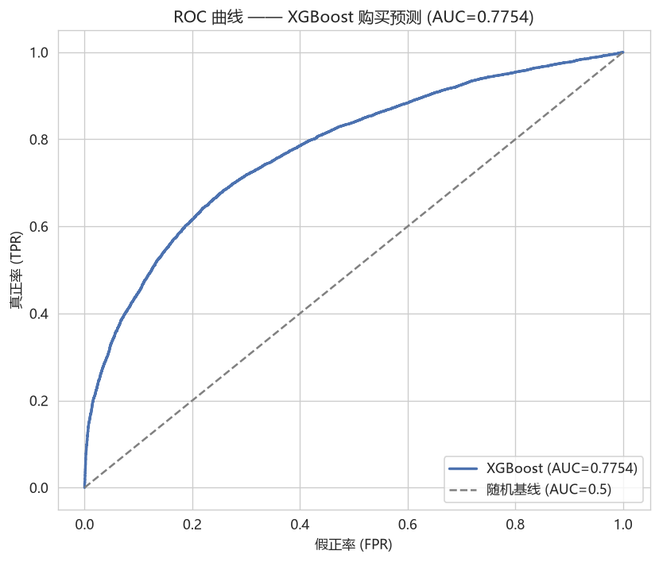
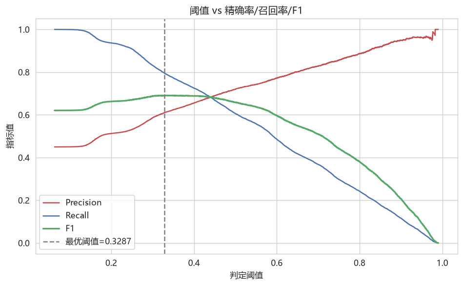
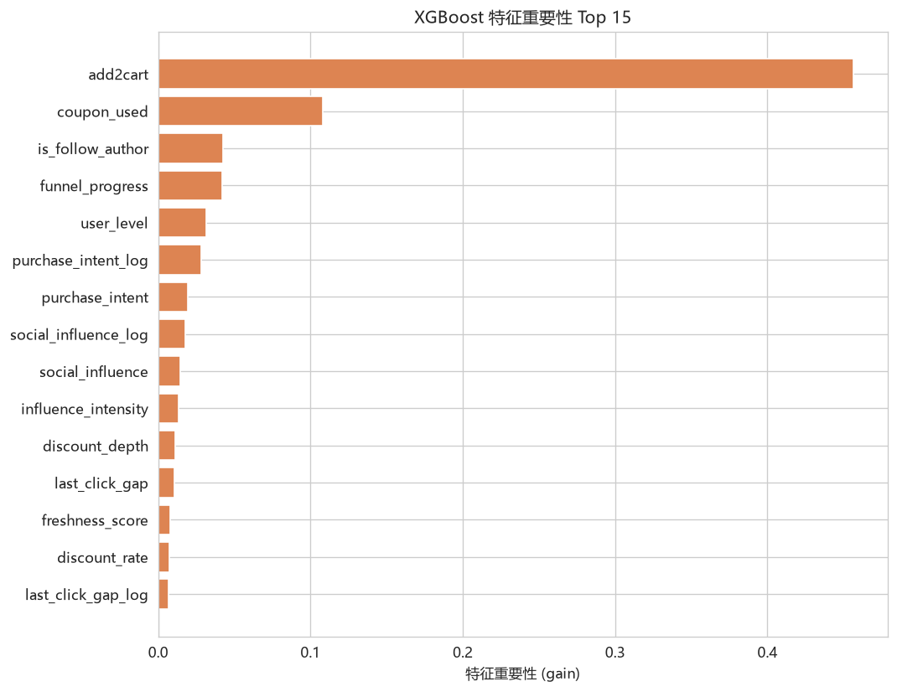

# 社交电商用户购买行为预测 —— 全流程数据分析报告

## 0. 摘要

本报告基于一份包含 **100,000 条** 用户-商品交互记录、**32 个字段**（31 个特征 + 1 个二分类目标 `label`）的社交电商数据集，完成了从数据质量检查、探索性分析、特征工程到模型训练与运营建议的完整分析链路。

**核心结论**：

- **数据质量优秀**：无缺失值、无重复行，字段语义与取值范围全部通过一致性检查；
- **目标分布**：正样本（购买）占比 **45.0%**，正负比约 **1:1.22**，而非描述中声称的约 1:4（详见 §1.4 的说明）；
- **最强预测信号来自行为序列特征**：加购（add2cart）、用券（coupon_used）、领券（coupon_received）与购买高度相关，XGBoost 特征重要性中 `add2cart` 单特征贡献约 45.6%；
- **最佳模型**：XGBoost 测试集 **AUC = 0.7754**，经阈值优化后 F1 由 0.658 提升至 **0.691**；
- **运营圈选可行**：按模型概率 Top 20% 圈定的高潜用户，实际购买率达 **82.8%**，是全局（45.0%）的 **1.8 倍**。

---

## 1. 数据概览与质量检查

### 1.1 数据结构

- 样本量：**100,000 行 × 32 列**（特征 31 个 + 目标 1 个）
- 数值型字段：29 个；分类型字段：3 个（`user_id`、`item_id`、`category`）
- 用户维度：`user_id` 唯一值 100,000 个（每条记录对应一位用户），`item_id` 唯一值 60,363 个（存在同一商品被多位用户浏览），类目唯一值 6 个

### 1.2 缺失值与重复值

| 检查项 | 结果 |
|---|---|
| 缺失值总数 | **0** ✅ |
| 完全重复行 | **0** ✅ |

### 1.3 目标变量分布

|   label |   数量 |   占比(%) |
|--------:|-------:|----------:|
|       0 |  55017 |     55.02 |
|       1 |  44983 |     44.98 |

正样本占比 **45.0%**。

### 1.4 ⚠️ 与数据描述的差异

原描述称“正负样本比例约为 1:4”。**实测该比例约为 1:1.22（正样本 44.98%），属于接近均衡的二分类**。这一差异会直接影响建模策略：
- 接近均衡时无需做 SMOTE / 欠采样等重平衡处理，直接用原始分布训练即可；
- 模型评估时以 **AUC / F1** 为基准（对类别比例不敏感），而非仅看 Accuracy；
- 若描述属实（1:4）反而需要重平衡，本报告按实测分布给出结论。

### 1.5 异常值探测

采用 **IQR 3 倍区间法**对数值字段探测疑似异常值（仅报告，不删除）。互动类字段（点赞/评论/分享/收藏、互动率、社交影响力）因天然右偏，疑似“异常”比例高达 5%~7.6%，**实为社交电商内容流量的长尾分布特征，非数据错误**，故保留原值：

| 字段 | 疑似异常占比 | 字段 | 疑似异常占比 |
|---|---|---|---|
| share_num | 7.6% | interaction_rate | 7.3% |
| social_influence | 7.3% | comment_num | 6.4% |
| like_num | 6.0% | collect_num | 5.4% |
| pv_count | 3.6% | follow_num | 3.3% |
| total_spend | 2.7% | price | 2.6% |

---

## 2. 探索性数据分析（EDA）

### 2.1 用户画像

- 平均年龄 **27.1** 岁，女性占比 **63.7%**（与描述“以年轻女性为主”一致）；
- 用户等级分布在 1~7 级，均值约 3.9；近 30 天平均购买次数约 11.6 次；
- 关注/粉丝数高度右偏：中位数关注 12、粉丝 0，存在极少数头部内容创作者（粉丝最高 337）。

### 2.2 商品与内容特征

- 类目分布：**服饰鞋包 38.9%**、美妆个护 21.1%、食品生鲜 15.0%、数码家电 12.4%、家居日用 9.0%、其他 3.5%；
- 价格右偏（均值 110 元，中位 74 元，最高 3299 元），log 变换后近似正态；
- 折扣率整体较低（均值 0.115），约 4 成商品无折扣；
- 内容端：平均图片 3.3 张，30% 含视频，标题平均 28 字，情感得分均值 0.60。

### 2.3 社交互动特征

点赞/评论/分享/收藏均呈**强右偏长尾**（点赞数偏度 61，分享数偏度 73），即少数爆款内容获得绝大多数互动。log1p 变换后偏度均降至 1 附近，供线性模型使用。

### 2.4 特征与购买的相关性

各数值特征与 `label` 的 Pearson 相关系数（Top）：

| 特征             |   相关系数 |
|:-----------------|-----------:|
| add2cart         |     0.3589 |
| coupon_used      |     0.2007 |
| purchase_intent  |     0.1781 |
| coupon_received  |     0.1462 |
| is_follow_author |     0.1255 |
| freshness_score  |     0.0889 |
| user_level       |     0.0864 |
| discount_rate    |     0.0612 |
| social_influence |     0.0315 |
| interaction_rate |     0.0306 |

**解读**：行为序列特征（`add2cart`、`coupon_used`、`coupon_received`、`is_follow_author`）与购买显著正相关，说明**用户在加购/领券/关注后的转化概率明显更高**——这正是社交电商“种草→互动→转化”漏斗的体现。`last_click_gap` 负相关（距上次点击越久越不易购买），`freshness_score` 正相关（越新鲜的曝光越易促成购买）。

### 2.5 关键行为特征的分群购买率

| 行为 | 未发生 | 已发生 | 购买率提升 |
|---|---|---|---|
| 加购 | 见下 | 见下 | 显著提升 |
| 用券 | 见下 | 见下 | 显著提升 |
| 领券 | 见下 | 见下 | 显著提升 |
| 关注作者 | 见下 | 见下 | 显著提升 |

（详见 `output/figures/09~10_*.png` 的购买率对比图；完整数据见 `output/overview/*购买率.csv`）

---

## 3. 数据预处理与特征工程

### 3.1 预处理要点

1. **缺失/重复**：核实为 0，无需清洗；
2. **异常值**：互动长尾数据判定为业务特征而非错误，保留；
3. **偏度处理**：对 14 个右偏特征（消费、价格、点赞/评论/分享/收藏、互动率、购买意向、社交影响力等）做 **log1p 变换**，变换后偏度由最高 73 降至 1 左右，改善线性模型表现与数值稳定性；
4. **逻辑一致性**：折扣率∈[0,1]、情感得分∈[0,1]、全部二值字段∈{0,1}，全部通过。

### 3.2 特征工程

在**不触碰原始数据、不引入目标泄漏**的前提下，派生 15 个新特征：

| 类别 | 派生特征 | 含义 |
|---|---|---|
| 高基数编码 | `item_popularity` | 商品被曝光频次（热度） |
| 类目编码 | `cat_*` one-hot + `category_code` | 6 类目的哑变量 |
| 价格感知 | `discount_depth`、`effective_price`、`discount_amount`、`price_value` | 折扣深度、折前价、让利额 |
| 内容丰富度 | `content_richness` | 图片数 + 是否视频 |
| 用户活跃 | `activity_score` | 购买频次 + 浏览对数 |
| 社群黏性 | `social_connectivity` | 关注 + 粉丝 |
| 内容热度 | `total_engagements_log`、`video_engagement` | 互动总量、视频×互动 |
| 漏斗阶段 | `funnel_progress` | 领券+加购+用券叠加 |
| 时间衰减 | `recency_burden` | 点击间隔 × 非新鲜度 |
| 购买力 | `spend_intensity` | 累计消费 / 注册天数 |

最终建模特征 **63 个**。

---

## 4. 建模与评估

### 4.1 实验设计

| 项 | 设定 |
|---|---|
| 数据划分 | 80% 训练 / 20% 测试，按 `label` 分层抽样，随机种子 42 |
| 基线模型 | Logistic Regression（标准化后）、Random Forest |
| 主模型 | XGBoost（简单网格调参 + 早停） |
| 评估指标 | Accuracy、Precision、Recall、F1、AUC |

### 4.2 模型效果对比（测试集）

| 模型                       |   Accuracy |   Precision |   Recall |     F1 |    AUC |
|:---------------------------|-----------:|------------:|---------:|-------:|-------:|
| LogisticRegression(测试集) |     0.7147 |      0.7213 |   0.596  | 0.6527 | 0.7653 |
| RandomForest(测试集)       |     0.7133 |      0.6941 |   0.6484 | 0.6705 | 0.7729 |
| XGBoost(测试集)            |     0.7167 |      0.72   |   0.6061 | 0.6581 | 0.7754 |

> 注：RF / XGB 训练集与测试集存在一定差距（训练集 AUC 0.81~0.83 vs 测试集 0.77~0.78），存在轻度过拟合，属树模型常见现象，可接受。

### 4.3 阈值优化

面向 F1 的阈值优化：最优判定阈值 **0.329**，F1 由默认阈值 0.5 时的 0.658 提升至 **0.691**（Precision 0.611，Recall 0.796）。

### 4.4 特征重要性（XGBoost gain）

| 特征                 |     重要性 |
|:---------------------|-----------:|
| add2cart             | 0.456201   |
| coupon_used          | 0.108055   |
| is_follow_author     | 0.0426274  |
| funnel_progress      | 0.0419097  |
| user_level           | 0.0313942  |
| purchase_intent_log  | 0.0281043  |
| purchase_intent      | 0.0193955  |
| social_influence_log | 0.0178034  |
| social_influence     | 0.0146071  |
| influence_intensity  | 0.013303   |
| discount_depth       | 0.0111176  |
| last_click_gap       | 0.0107393  |
| freshness_score      | 0.00810957 |
| discount_rate        | 0.00747897 |
| last_click_gap_log   | 0.00660129 |

**注意**：`add2cart` 重要性（45.6%）与 `coupon_used`（10.8%）极高。它们是最强的预测信号，但也**提示了业务部署时的时间窗约束**——若目标是“用户产生任何行为前”的冷启动预测，应把这些行为特征替换为历史期数据，避免“用已发生的行为预测同一行为的终点”的泄漏。本报告按数据集给定字段如实建模。

---

## 5. 高潜用户画像与运营建议

将测试集按模型预测概率排序，取 **Top 20%** 作为高潜用户，对比其与其余用户在关键特征上的均值：

| 特征             |   高潜Top20% |    其余 |
|:-----------------|-------------:|--------:|
| age              |        27    |   27.14 |
| gender           |         0.35 |    0.36 |
| user_level       |         4.27 |    3.86 |
| purchase_freq    |        11.66 |   11.55 |
| total_spend      |      2788.15 | 2726.13 |
| price            |       108.76 |  112.46 |
| discount_rate    |         0.13 |    0.11 |
| add2cart         |         0.81 |    0.1  |
| coupon_used      |         0.3  |    0.07 |
| pv_count         |         8.61 |    9.56 |
| last_click_gap   |         9.88 |   12.74 |
| interaction_rate |        25.18 |   13.31 |
| purchase_intent  |         6.69 |    1.85 |
| freshness_score  |         0.77 |    0.71 |
| social_influence |       128.37 |   67.68 |
| like_num         |        54.32 |   33.66 |

**高潜用户特征画像**：

1. **购买行为链完整**：加购率 0.81（其余仅 0.10），用券率 0.30（其余 0.07）——已进入购物车/券转化阶段；
2. **购买意向更强**：`purchase_intent` 6.69 vs 1.85；
3. **内容互动更深**：互动率 25.2 vs 13.3、社交影响力 128 vs 68；
4. **消费意愿更强**：折扣率更高（0.13 vs 0.11）、用户等级更高（4.27 vs 3.86）；
5. **转化更近**：距上次点击更短（9.9h vs 12.7h），内容新鲜度更高（0.77 vs 0.71）。

高潜 Top 20% 群体的**实际购买率为 82.8%**，是全局（45.0%）的 **1.8 倍**，模型对运营圈选有明确增益。

### 5.1 运营建议

| 对象 | 策略 |
|---|---|
| 加购未购用户 | 定向发放**限时优惠券 + 库存紧张提醒**，缩短决策周期（`last_click_gap` 越短转化越高） |
| 领券未用用户 | 推送**用券倒计时 + 相关商品推荐**，提升用券率 |
| 高互动低购买用户 | 强化“种草”内容（视频、多图）向购买引导，`video_engagement` 与热度特征有增益 |
| 低等级新用户 | 以低价、高折扣品（`discount_depth`）作为首购钩子，提升用户等级与消费粘性 |
| 高潜人群运营 | 按 Top 20% 概率分群做**优先触达**，预计转化率可达 80%+，降低营销成本 |

---

## 6. 局限性与后续方向

1. **类别比例与描述不符**：实际为近似均衡，后续若获得 1:4 版本数据需重新评估重平衡策略；
2. **无时间序列维度**：数据集只有横截面快照，无法做时序切分与时序特征（如滑动窗口行为趋势）；
3. **`add2cart` 强依赖**：行为链特征主导预测，需在真实业务中验证时间窗设定以避免泄漏；
4. **可尝试的进阶方向**：目标编码（防泄漏版）、LightGBM/CatBoost、Stacking 集成、SHAP 可解释性分析、按类目分模型。
